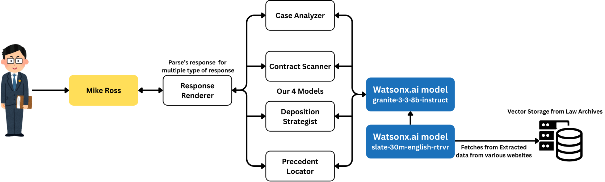

<div align="center">


<h1 style="font-size:2.6rem; font-weight:700; letter-spacing:-1px; margin-top:0.5rem;">Mike Ross – AI Legal Intelligence Assistant</h1>
<div style="margin-top:4px; font-weight:600; font-size:0.95rem; letter-spacing:0.5px; background:#0f62fe; color:#fff; display:inline-block; padding:4px 12px; border-radius:999px;">IBM TechXchange Hackathon</div>

<p style="font-size:1.05rem; max-width:760px; line-height:1.5;">
<strong>Mike Ross</strong> accelerates the most time‑consuming layers of legal work – document digestion, precedent surfacing, contract pattern detection, and deposition strategy scaffolding – so lawyers can reclaim hours for judgment, creativity, and advocacy. Under the hood we leverage <strong>IBM watsonx</strong> foundation capabilities (Granite family + watsonx.ai Embeddings) for reasoning and long‑term contextual recall. <br/><br/>
<em>It does <u>not</u> replace licensed professionals. It removes mechanical friction so strategic legal minds can do higher‑order thinking sooner.</em>
</p>

<p>
<a href="#-quick-start">🚀 Quick Start</a> •
<a href="#-core-modules">🧠 Core Modules</a> •
<a href="#-workflow-flow-chart">🔄 Flow</a> •
<a href="#-why-not-a-replacement">⚖️ Philosophy</a> •
<a href="#-architecture">🏗 Architecture</a> •
<a href="#-roadmap">🛣 Roadmap</a>
</p>

</div>

---

## ✨ Value Proposition

| Pain Today | Mike Ross Leverage | Outcome |
|------------|--------------------|---------|
| Manually skimming hundreds of pages | Hierarchical semantic + structural parsing | 10–30× faster issue spotting |
| Siloed precedent search | Context‑aware prompt routing + metadata enrichment | Higher relevance, fewer false positives |
| Contract clause drift & risk blind spots | Clause fingerprinting + anomaly surfacing | Reduced review fatigue; earlier red‑flag discovery |
| Unstructured deposition prep | Strategy template synthesis from facts + roles | Sharper questioning frameworks |

---

## 🧠 Core Modules

The UI exposes four specialized intelligence pipelines (internally alignable with distinct backend model chains). Each module consumes shared session + document context but optimizes output formatting for task semantics.

| Module (UI) | Endpoint | Primary Purpose | Input Signals | Output Artifacts | Typical Use Cases |
|-------------|----------|-----------------|--------------|------------------|------------------|
| Case Analyzer | `/analyze/case-breaker` | Multi‑document factual + issue synthesis | Uploaded docs, user prompt | Issue matrix, timeline fragments, risk clusters | Early case assessment, motion framing |
| Precedent Locator | `/analyze/precedent-strategist` | Surface analogous authority & fact patterns | Legal issue, jurisdictional hints, extracted entities | Ranked precedent list, similarity rationales, citation scaffolds | Brief drafting, argument refinement |
| Contract Scanner | `/analyze/contract-xray` | Clause extraction, deviation & risk highlighting | Contract type, structured section parsing | Clause table, deviation flags, negotiation levers | Vendor / SaaS / MSA redlines |
| Deposition Strategist | `/analyze/deposition-strategist` | Question funnel & thematic outline generation | Parties, role context, factual clusters | Topic tree, question banks, sequencing strategy | Witness prep, discovery planning |

### Module Intelligence Layers (Conceptual)
1. Ingestion: Normalizes PDFs / DOCX → text + structural blocks.
2. Embedding & Indexing: watsonx.ai Embedding model produces dense vectors; optional BM25 sparse layer for exact term alignment.
3. Context condenser: Hybrid similarity + legal‑aware scoring ranks chunks; packs prompt budget.
4. Reasoning: Granite instruction‑tuned model (e.g. Granite 13B Instruct*) guided by module‑specific dynamic prompt templates.
5. Post‑processing: Structured extraction, clause tagging, chart generation & metadata confidence decoration.

<sub>*Granite model selection can be swapped (size/perf) per deployment constraints.</sub>

---

## 🔄 Workflow (Flow Chart)

<div align="center">
	
	<br/>
	<em>End‑to‑end pipeline from document ingestion to structured legal intelligence output.</em>
</div>

### watsonx Integration Highlights
| Stage | watsonx Component | Purpose |
|-------|-------------------|---------|
| Embedding Store | watsonx.ai Embedding API | Vectorize paragraphs, clauses, factual clusters for fast semantic retrieval of prior & current case material |
| Retrieval Fusion | (Client logic + backend) | Blend embedding cosine similarity with keyword/legal issue weighting |
| Reasoning Core | Granite (instruction tuned) | Multi‑step prompt chain: summarization → issue framing → refinement / strategy synthesis |
| Memory Refresh | Granite + Embeddings | Periodically re‑embed evolving session summaries for future turns |

> Prior cases are embedded once; future queries reference them without re‑processing full text, yielding latency + cost savings.

---

## ⚖️ Why Not A Replacement?

Mike Ross augments; it does not adjudicate. It does not:
* Form an attorney‑client relationship
* Provide definitive legal advice
* Guarantee jurisdictional conformity
* Replace professional duty of care / ethical judgment

It does:
* Compress rote review time
* Increase surface area of considered angles
* Highlight—not decide—risk & relevance
* Free lawyers for strategy, negotiation, persuasion, creativity

> Think of it as a junior associate who never sleeps, drafts structured thinking aids, and cites candidate directions—while you remain accountable for final legal reasoning.

---

## 🏗 Architecture (Frontend Perspective)

| Layer | Key Files | Responsibility |
|-------|-----------|----------------|
| UI Shell | `src/components/FileUpload.jsx` | Case classification, upload lifecycle, module selection, chat container |
| Module Selector | `src/components/chat/ModuleBar.jsx` | Horizontal module pill switching |
| Conversation Orchestration | `src/components/chat/useCaseChat.js` | Session GUID creation, endpoint routing, message state, module metadata |
| Messaging UI | `src/components/chat/Messages.jsx` | Markdown + structured JSON rendering (charts, summaries, metadata) |
| Input Control | `src/components/chat/ChatInput.jsx` | Prompt capture, send interactions |
| API Config | `src/config/api.js` | Backend base URL resolution |

### Structured Response Handling
Assistant responses may include `structured_data` containing:
```jsonc
{
  "analysis": "Markdown body ...",
  "summary": "Executive summary ...",
  "charts": [ { "type": "bar", "data": { /* chart.js dataset */ } } ],
  "metadata": { "confidence": "high", "analysis_type": "risk" },
  "recommendations": "...",
  "warnings": "..."
}
```
`Messages.jsx` detects charts & auxiliary sections and renders them with Chart.js components.

### 🧬 Model & Retrieval Stack (Conceptual Overview)
| Layer | Technology (Hackathon Edition) | Notes |
|-------|--------------------------------|-------|
| Foundation Reasoning | IBM watsonx Granite (Instruct variant) | Handles structured legal narrative synthesis & strategy scaffolding |
| Embeddings | watsonx.ai Embedding Model | Dense vector representation of normalized text + historical case memory |
| Hybrid Retrieval | Vector (cosine) + lexical (BM25 / keyword filters) | Balances semantic similarity with statutory / clause specificity |
| Prompt Orchestration | Module templates + few‑shot exemplars | Tailors reasoning chain per module goal |
| Safety / Guardrails | Output filtering + disclaimers | Frontend messaging + optional backend policy checks |

Historical cases are stored as embedding vectors; only lightweight metadata (case_title, doc IDs) persists locally on the client for session continuity. Retrieval merges current upload context with historically similar fact or clause vectors to enrich Granite prompts.

> This architecture enables rapid experimentation during the IBM TechXchange Hackathon while remaining extensible for production (swap in guarded Granite endpoints; add encrypted vector store; apply tenancy controls).

---

## 🚀 Quick Start

Prerequisites: Node 18+ (LTS), npm or yarn, running backend exposing the documented endpoints.

1. Clone & install
	```bash
	npm install
	```
2. Configure environment
	* Create `.env` with: `REACT_APP_BACKEND_URL=http://localhost:8000`
3. Start dev server
	```bash
	npm start
	```
4. Open `http://localhost:3000` and upload documents, choose a module, ask a question.

### Production Build
```bash
npm run build
```
Generates optimized assets in `build/`.

---

## 🔐 Data Handling & Privacy (Pluggable Guidelines)
| Aspect | Current (Frontend) | Notes |
|--------|--------------------|-------|
| Storage | `localStorage` for `case_title` / `session_id` | Replace with encrypted tokens for multi‑tenant prod |
| Transport | `fetch` POST (multipart for uploads) | Add auth headers / signed URLs in secure env |
| PII Redaction | (Backend responsibility) | Consider pre‑upload client redaction patterns |

### watsonx Considerations
| Topic | Hackathon Approach | Future Hardening |
|-------|--------------------|------------------|
| Credential Management | Local `.env` (server side) | Secret manager (Vault / IBM Secrets Manager) |
| Model Selection | Single Granite instruct size | Dynamic routing by task complexity & token budget |
| Vector Storage | In‑memory / lightweight store | Encrypted persistent vector DB (pgvector / Milvus / Elastic) |
| Cost Awareness | Batch embedding on upload | Delta re‑embedding & caching |

---

## 📏 Reliability & Safeguards
| Concern | Mitigation Concept |
|---------|-------------------|
| Hallucinated precedent | Require citation + retrieval confidence display |
| Outdated law | Integrate jurisdictional date filters + update signals |
| Over‑reliance | UI disclaimers + encourage manual verification |
| Confidential leakage | Local preprocessing, zero retention policy, access logging |

---

## 🛣 Roadmap (Excerpt)
| Phase | Focus | Highlights |
|-------|-------|-----------|
| 1 | Core UX polish | Drag/drop stability, richer error surfacing |
| 2 | Retrieval quality | Hybrid (BM25 + semantic) layering, citation validation loop |
| 3 | Collaboration | Shared sessions, annotatable highlights |
| 4 | Governance | Admin dashboard, redaction automation, audit trails |
| 5 | Advanced Reasoning | Multi‑turn strategy planning, risk scoring calibration |

---

## 🤝 Contributing (Lightweight)
1. Fork / branch
2. Feature or fix
3. Lint & test (add tests where logic added)
4. PR with clear description

---

## 🧾 License
Internal / Proprietary (Adjust this section if an OSS license applies.)

---

<div align="center" style="font-size:0.9rem; color:#555;">
Built to amplify legal strategy – not replace it. ⚖️
</div>

<sub>IBM, watsonx and Granite are trademarks of International Business Machines Corporation, registered in many jurisdictions worldwide. This project is an independent hackathon prototype and not an official IBM product.</sub>

